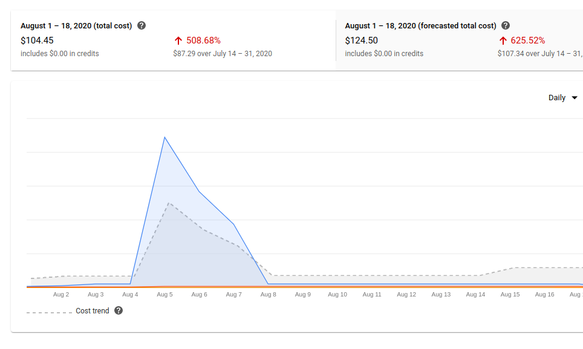
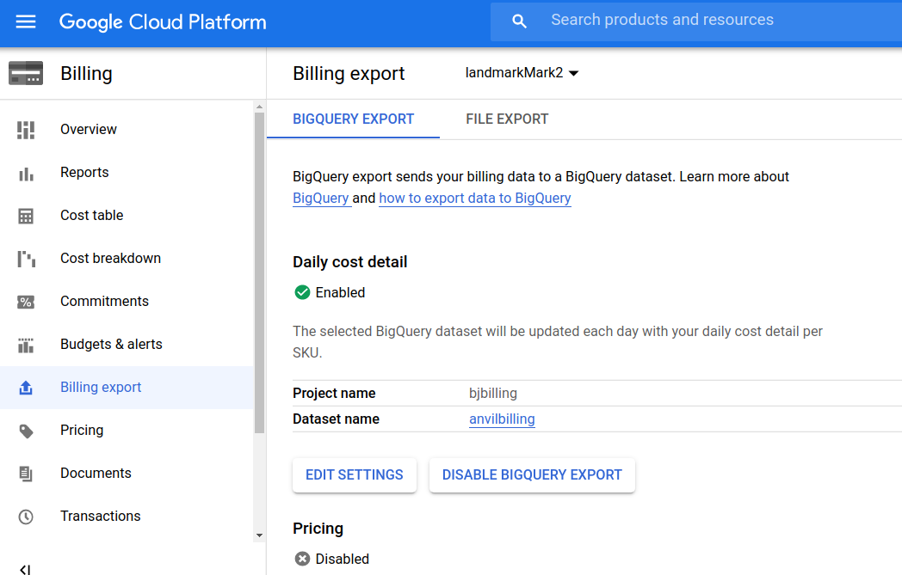

# Introduction

Detailed billing information is essential for cost and resource planning in cloud based analysis projects, but it can be difficult to obtain. The goal of this software is to help users of the Terra/AnVIL platform get access to this data as easily as possible.

The google cloud platform console can be used to acquire
information at varying levels of detail.  For example, it
is simple to generate a display like the following.



However, the cost track here sums up charges for various
activities related to CPU usage, storage, and network use.
Our aim is to provide R functions
to help present information on charges arising
in the use of AnVIL.

To whet the appetite, we will show how to run an exploratory app
that looks like:


# Setup

The functions in this vignette require a user to connect the billing export in the Google Cloud Platform project associated with Terra/AnVIL to a BigQuery dataset.

General information on this process can be found here:

https://cloud.google.com/billing/docs/how-to/export-data-bigquery

In order to set this up with the AnVIL/Terra system:

1. Create a new project in Google under the billing account linked to the Terra project
2. Create a BigQuery dataset to store the billing export
3. Go to the billing tab in the gcloud console and enable export to this dataset
4. Make sure the user of this software has the BigQuery scope on the billing project

Once this is accomplished you will be able to see



with values appropriate to your project and account
configuration substituted for 'landmarkMark2' (the compute project name),
'bjbilling' (the Google project with BigQuery scope that is used
to transmit cost data on landmarkMark2 to Bigquery), and
'anvilbilling' (the BigQuery dataset name where next-day cost values
are stored).

# Obtaining billing data

## Overview

Billing data is generally available 1 day after incurring charges. Billing data is stored in BigQuery in a partitioned table, and is queryable using the bigrquery package.

## Setting up a request

In order to generate a request you need:

1. start: date of start of reckoning
2. end: date of end of reckoning
3. project: GCP project id
4. dataset: GCP dataset id for billing data in BigQuery
5. table: GCP table for billing data in BigQuery

Then you can use the function:

```{}
setup_billing_request(start, end, project, dataset, table, billing_code)
```

To create a request.

Once you have a request object, then you can get the billing data associated with that request using the reckon() function on your billing request.

## Output

The result of a reckoning on a billing request is an instance of `avReckoning`

We took a snapshot of usage in a project we work on, and it is available as demo_rec. This request represents one day of usage in AnVIL/Terra.

```{r lkd}
suppressPackageStartupMessages({
library(AnVILBilling)
library(dplyr)
library(magrittr)
library(BiocStyle)
})

demo_rec
```
The available keys for the billing object are shown.

For Terra, 3 of the most useful keys are:

1. terra-submission-id : this key is associated with a cromwell workflow execution
2. cromwell-workflow-id : this key is associated with a job in a workflow, so if you apply a workflow to multiple inputs, you will have 1 terra id and multiple cromwell ids
3. goog-dataproc-cluster-name : this key is associated with a jupyter notebook or Rstudio cluster on Terra. The user of these resources can be
determined using Bioconductor's `r Biocpkg("AnVIL")` package.

The code, to be used while the cluster
is in use, would look like this:
```{}
library(AnVIL)
leo = Leonardo()
leo$getRuntime(clustername)
```


# Drilling down

Given a key type, we want to know associated values.
```{r lklklk}
v = getValues(demo_rec@reckoning, "terra-submission-id")
v
```

To understand activities associated with this submission,
we subset the table.

```{r adasd}
s = subsetByKeyValue(demo_rec@reckoning, "terra-submission-id", v)
s
```
The following data is available in this object

```{r vars}
names(s)
```

You can drill down more to see what products used during the submission:
```{r lkpr}
AnVILBilling:::getSkus(s)
```

You can also get the cost for a workflow using:

```{r cost}
data(demo_rec) # makes rec
v = getValues(demo_rec@reckoning, "terra-submission-id")[1] # for instance
getSubmissionCost(demo_rec@reckoning,v)
```

And the ram usage as well:

```{r ram}
data(demo_rec) # makes rec
v = getValues(demo_rec@reckoning, "terra-submission-id")[1] # for instance
getSubmissionRam(demo_rec@reckoning,v)
```


# Using the exploratory app

To simplify some of the aspects of reporting on costs, we have introduced
`browse_reck`, which will authenticate the user to Google BigQuery, and
use user-specified inputs to identify an interval of days between which
usage data are sought.  This function can be called with no arguments,
or you can supply the email address for the Google identity to be used
in working with Google Cloud Platform projects and BigQuery.
